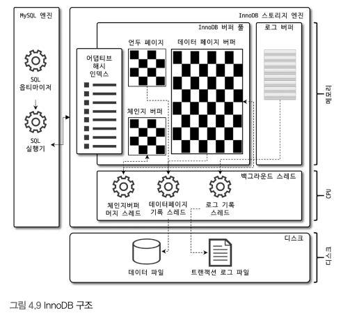
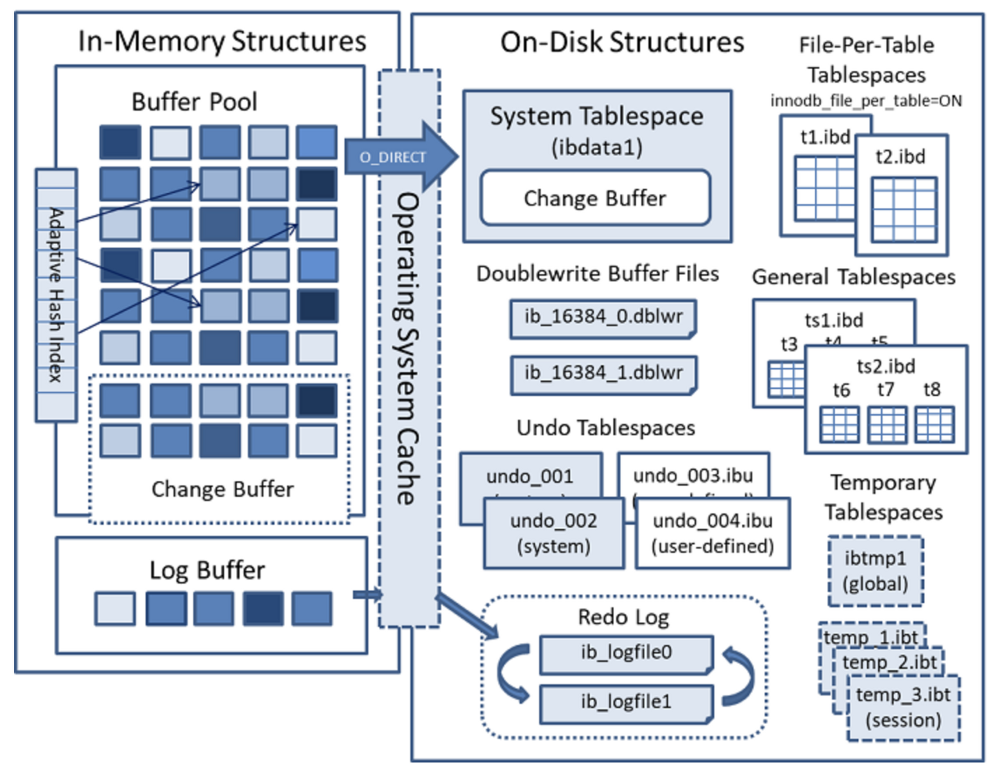

# 아키텍처

## MySQL 엔진 아키텍처
- MySQL 엔진
  - 구성
    - 커넥션 핸들러
    - SQL 인터페이스
    - SQL 파서 및 전처리기
    - 옵티마이저
    - 캐시 및 버퍼
- 스토리지 엔진
  - MySQL은 스토리지 엔진을 통해 데이터를 저장하고 관리한다.
  - 스토리지 엔진은 MySQL 서버와 데이터베이스 파일 간의 인터페이스 역할을 한다.
  - InnoDB
    - MySQL 5.5 버전부터 기본 스토리지 엔진으로 사용된다.
    - 트랜잭션 처리와 복구 기능을 제공한다.
    - 테이블 락을 최소화하기 위해 다중 버전 동시성 제어(MVCC)를 사용한다.
  - MyISAM
    - MySQL 5.5 버전 이전에 기본 스토리지 엔진으로 사용되었다.
    - 테이블 락을 사용한다.
    - 풀 텍스트 인덱스를 지원한다.
  - Memory
    - 메모리에 데이터를 저장한다.
    - 데이터베이스를 재시작하면 데이터가 사라진다.
- 핸들러 API
  - 핸들러(Handler) 요청
    - MySQL 엔진의 쿼리 실행계에서 데이터를 쓰거나 읽어야 할 때는 각 스토리지 엔진에 쓰기 또는 읽기를 요청한다. 
    - 이때 MySQL 엔진과 스토리지 엔진 간의 데이터 교환을 위해 사용하는 API가 핸들러 API이다.
  - InnoDB 스토리지 엔진 또한 이 핸들러 API를 이용해 MySQL 엔진과 데이터를 주고받는다. 
  - 핸들러 API를 통해 얼마나 많은 데이터(레코드) 작업이 있었는지는 SHOW GLOBAL STATUS LIKE 'Handler%'; 명령으로 확인할 수 있다.


## InnoDB 스토리지 엔진 아키텍처


- 프라이머리 키에 의한 클러스터링
  - InnoDB의 모든 테이블은 프라이머리 키를 기준으로 클러스터링되어 저장된다.
  - 따라서 프라이머리 키 값의 순서대로 디스크에 저장되며, 세컨더리 인덱스는 레코드의 주소 대신 프라이머리 키의 값을 논리적인 주소로 사용한다.
  - 이 때문에 프라이머리 키는 다른 인덱스에 비해 실행 계획에서 비중이 높게 설정된다.
- 외래 키 지원
  - 외래 키에 대한 지원은 InnoDB 스토리지 엔진 레벨에서 지원하는 기능으로 MyISAM 이나 MEMORY 테이블에서는 사용할 수 없다.
  - 외래 키는 개발 환경에서 좋은 가이드 역할을 할 수 있지만, 쿼리 실행에서 잠금이 여러 테이블로 전파되기 때문에 데드락이 발생할 때가 많으므로 주의하는 것이 좋다.
  - 외래 키 관계 체크로 인해 수동으로 데이터를 적재하거나 스키마 변경시 작업이 실패할 수 있다.
- MVCC(Multi Version Concurrency Control)
  - 
  - 레코드 레벨의 트랜잭션을 지원하는 DBMS가 제공하는 기능으로 버전 관리를 통해 잠금을 사용하지 않는 일관된 읽기가 가능하다. 
  - InnoDB는 이를 Undo log를 이용하여 구현하고 있다.
  - 하나의 레코드에 대해 2개의 버전이 유지되고, 필요에 따라 어느 데이터가 보여지는지 여러 가지 상황에 따라 달라지는 구조
- 잠금 없는 일관된 읽기(Non-Locking Consistent Read)
  - InnoDB 스토리지 엔진은 MVCC 기술을 이용하여 잠금을 걸지 않고 읽기 작업을 수행한다. (격리 수준 SERIALIZABLE 제외).
  - 레코드에 대해 변경 작업이 이루어지더라도 다른 트랜잭션의 SELECT 작업을 방해하지 않는다.
  - 격리 수준이 `READ_UNCOMMITED`라면 InnoDB의 버퍼 풀 데이터를 읽고 `READ_COMMITED`, `REPEATABLE_READ`라면 언두 로그 데이터를 읽게 된다.
- 자동 데드락 감지
  - InnoDB 스토리지 엔진은 내부적으로 잠금이 교착 상태에 빠지지 않았는지 체크하기 위해 잠금 목록을 그래프(Wait-for List) 형태로 관리한다.
  - 데드락 감지 스레드가 주기적으로 잠금 대기 그래프를 검사하여 교착 상태에 빠진 트랜잭션을 강제 종료한다.
  - 트랜잭션 중 언두 로그의 양이 가장 작은 트랜잭션이 롤백을 실행해도 서버의 부하를 덜 일으키기 때문에 언두 로그 양으로 종료 대상을 선정한다.
  - InnoDB 스토리지 엔진은 상위 레이어인 MySQL 엔진의 테이블 잠금을 볼 수 없어 데드락 감지가 불확실할 수도 있다.
  - `innodb_tagle_locks` 시스템 변수를 활성화하면, InnoDB 스토리지 엔진 내부의 레코드 잠금뿐만 아니라 테이블 레벨의 잠금까지 감지할 수 있다.
- 자동화된 장애 복구
  - MySQL이 장애로 인해 예기치 않게 종료되었을 경우, innodb_force_recovery 시스템 변수를 1~6으로 설정하여 MySQL 서버를 다시 시작할 수 있다.
  - MySQL 서버를 재시작한 후에는 mysqldump 프로그램이나 SELECT INTO OUTFILE… 명령어를 이용하여 덤프 후 데이터베이스를 다시 구축하는 것이 좋다.
- InnoDB 버퍼 풀
  - InnoDB 스토리지 엔진에서 가장 핵심적인 부분으로, 디스크의 데이터 파일이나 인덱스 정보를 메모리에 캐시해 두는 공간이다.
  - 쓰기 작업을 지연시켜 일괄 작업으로 처리할 수 있게 해주는 버퍼 역할도 한다.

  - 버퍼 풀의 크기 설정
    - InnoDB 버퍼 풀은 innodb_buffer_pool_size 시스템 변수로 설정할 수 있으며, 동적으로 크기를 변경할 수 있다.
    - 운영체제의 전체 메모리 공간의 50%정도만 버퍼풀로 설정하고 조금씩 올려가면서 최적점을 찾는 것이 좋다.
    - innodb_buffer_pool_instances 변수를 통해 버퍼 풀의 개수를 설정할 수 있으며 디폴트 값은 8이다.
    - 버퍼 풀 인스턴스당 5GB 메모리를 사용할 수 있도록 설정하는 것이 좋다.
  - 버퍼 풀의 구조
    - 버퍼 풀이라는 거대한 메모리 공간을 페이지 크기(innodb_page_size 시스템 변수에 설정된)의 조각을 쪼개어 스토리지 엔진이 데이터를 필요로 할 때 해당 데이터 페이지를 읽어서 각 조각에 저장한다.
    - 버퍼 풀의 페이지 크기 조각을 관리하기 위해 LRU(Least Recently Used), Flush, Free 리스트 자료구조를 사용한다.
  - InnoDB 스토리지 엔진에서 데이터를 찾는 과정
    - 어댑티브 해시 인덱스와 B-Tree 인덱스를 이용하여 데이터 페이지가 버퍼 풀에 있는지 검사
    - 없다면 디스크에서 필요한 데이터 페이지를 버퍼 풀에 적재, 해당 페이지에 대한 포인터를 LRU 헤더에 추가. 데이터 페이지가 실제로 읽혔을 경우 MRU 방향으로 승급
    - 있다면 해당 페이지 포인터를 MRU 방향으로 승급
    - 필요한 데이터가 자주 접근되었다면 어댑티브 해시 인덱스에 추가
    - LRU 리스트
      - 디스크로부터 읽어온 페이지를 최대한 오랫동안 InnoDB 버퍼풀에 메모리에 유지하여 디스크 읽기를 최소화하기 위해 사용.
      - 거의 사용되지 않는 데이터 페이지는 LRU의 끝으로 밀려나 버퍼 풀에서 제거된다.
    - Flush 리스트
      - 디스크로 동기화되지 않은 데이터를 가진 데이터 페이지(더티 페이지) 목록 관리
    - Free 리스트
      - InnoDB 버퍼 풀에서 실제 사용자 데이터로 채워지지 않은 비어 있는 페이지들의 목록
  - 버퍼 풀 상태 백업 및 복구
    - 디스크의 데이터가 버퍼 풀에 적재되어 있는 상태를 워밍업이라고 표현하는데, 이는 몇십 배의 쿼리 처리 속도 차이를 보인다.
    - 이를 위해 innodb_buffer_pool_dump_now를 사용하여 버퍼 풀의 상태를 백업하고 복구할 수 있다.
  - 버퍼 풀의 적재 내용 확인
    - information_schema의 innodb_cached_indexes 테이블을 통해 인덱스별로 데이터 페이지가 얼마나 InnoDB 버퍼 풀에 적재되어 있는지 확인할 수 있다.

- Double Write Buffer
  - 리두 로그는 공간 낭비를 막기 위해 페이지의 변경된 내용만 기록한다.
  - 이로 인해 플러시에 문제가 발생하여 일부만 기록되면 해당 페이지의 내용은 복구할 수 없을 수 있다.
  - 이를 파셜 페이지(Partial-page) 또는 톤 페이지(Torn-page)라고 한다.
  - 이런 현상은 하드웨어의 오작동이나 시스템의 비정상 종료 등으로 발생할 수 있다.
  - 이를 해결하기 위한 방법으로 Double-Write 기법을 이용한다.
  - 더티페이지를 데이터 파일에 기록하기 전에 더티페이지를 묶어 시스템 테이블스페이스의 DoubleWrite 버퍼에 기록한다.
  - 해당 기능은 innodb_doublewrite 시스템 변수로 사용 여부를 결정할 수 있다.

- 언두 로그
  - InnoDB 스토리지 엔진은 트랜잭션과 격리 수준을 보장하기 위해 DML로 변경되기 이전 버전의 데이터를 별도로 백업한다.
  - 언두 로그의 기능
    - 트랜잭션 보장
      - 트랜잭션의 롤백시, 데이터 복구 과정에서 언두 로그에 백업한 데이터를 이용한다.
    - 격리 수준 보장
      - 트랜잭션 격리 수준이 READ_COMMITED이거나 REPEATABLE_READ일 경우 언두 로그의 데이터를 읽어서 반환한다.

  - 언두 로그 레코드 모니터링
    - 대용량의 데이터를 처리하거나 오랜 시간 실행되는 트랜잭션으로 인해 언두 로그의 양이 증가할 수 있다.
    - InnoDB 스토리지 엔진은 언두 로그의 이력을 필요한 만큼 스캔해야 레코드를 찾을 수 있기 때문에 쿼리 성능이 떨어질 수 있다.
    - MySQL 서버의 언두 로그 레코드를 모니터링하여 급증 여부를 확인하자.

  - 언두 테이블스페이스 관리
    - 언두 로그가 저장되는 공간을 언두 테이블스페이스라고 한다.
    - MySQL 5.6 이전 버전에서는 언두 로그를 모두 시스템 테이블스페이스에 저장했지만, 이는 MySQL 서버가 초기화될 떄 생성되기 때문에 확장에 한계가 있었다.
    - 이는 MySQL 8.0 으로 업그레이드되면서 언두 로그는 항상 시스템 테이블스페이스 외부의 별도 로그 파일에 기록되도록 개선되었다.


하나의 언두 테이블스페이스는 1개 이상 128개 이하의 롤백 세그먼트를 가진다.

롤백 세그먼트는 InnoDB의 페이지 크기를 16바이트로 나눈 값의 개수만큼 언두 슬롯을 가진다.

일반적으로 하나의 트랜잭션은 2개 정도의 언두 슬롯을 필요로 하며, 최대 동시 처리 가능한 트랜잭션의 개수는 아래와 같이 계산할 수 있다.

```
최대 동시 트랜잭션 수 = (InnoDB 페이지 크기) / 16 * (롤백 세그먼트 개수) * (언두 테이블스페이스 개수)
```

- 언두 로그 Truncate 방법
  - 자동 모드
    - InnoDB 스토리지 엔진의 퍼지 스레드가 주기적으로 불필요해진 언두 로그를 삭제하고 운영체제로 반납하는 작업을 한다. 
    - innodb_undo_log_truncate로 활성 여부를 설정할 수 있으며 innodb_purge_rseg_truncate_frequency 를 통해 실행되는 빈도 수를 조절할 수 있다.
  - 수동 모드
    - 언두 테이블스페이스를 비활성화로 설정하면 퍼지 스레드는 언두 테이블스페이스를 찾아서 운영체제로 반납한다. 이후 다시 활성화하면 된다.
    - 수동 모드는 언두 테이블스페이스가 최소 3개 이상은 되어야 한다.


## MyISAM 스토리지 엔진 아키텍처
- 키 캐시
  - 히트율(Hit rate) = 100 - (Key_reads / Key_read_requests * 100)
  - 키 캐시 공간설정 하는 파라미터는 key_buffer_size
    ```
    key_buffer_size = 4GB
    kbuf_board.key_bufer_size = 2GB
    kbuf_comment.key_bufer_size = 2GB
    ``` 
- 운영체제의 캐시 및 버퍼
  - 운영체제의 캐시와 버퍼를 이용해 데이터를 읽고 쓴다.
  - 다른 어플리케이션에서 메모리를 모두사 용하면 운영체제가 캐시용도로 사용하는 메모리 공간이 없어진다.
- 데이터 파일과 프라이머리 키(인덱스) 구조
  - 프라이머리 키에 의한 클러스터링 없이 데이터 파일이 힙(Heap) 공간처럼 활용된다.
  - 프라이머리 키 값과 무관하게 순서대로 데이터 파일에 저장된다. 

## MySQL 로그 파일
- 에러 로그 파일
  - MySQL 서버에서 발생한 에러를 로그 파일에 기록한다.
- 제너럴 로그 파일
  - MySQL 서버의 모든 쿼리를 로그 파일에 기록한다.
- 슬로우 쿼리 로그 파일
  - long_query_time 시스템 변수에 설정한 시간 이상이 소요된 쿼리가 로그에 기록된다.
  - 실행 빈도 및 누적 실행 시간순 랭킹
    - `pt-query-digest` 명령으로 확인할 수 있다.